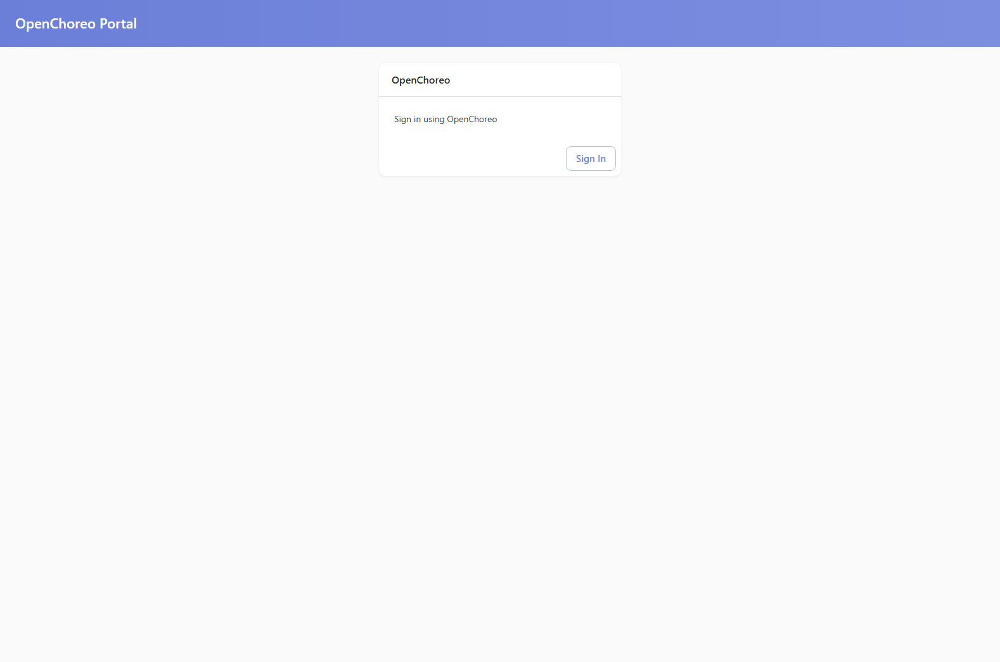
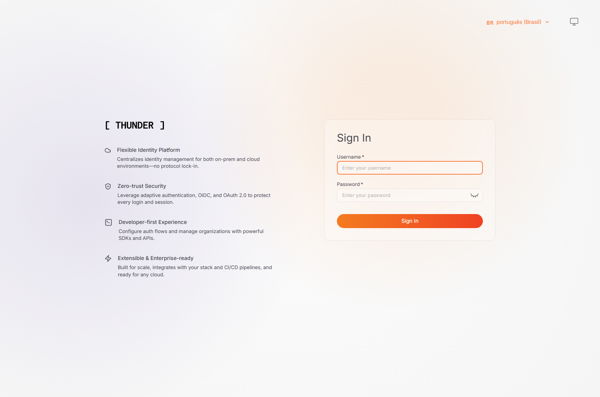
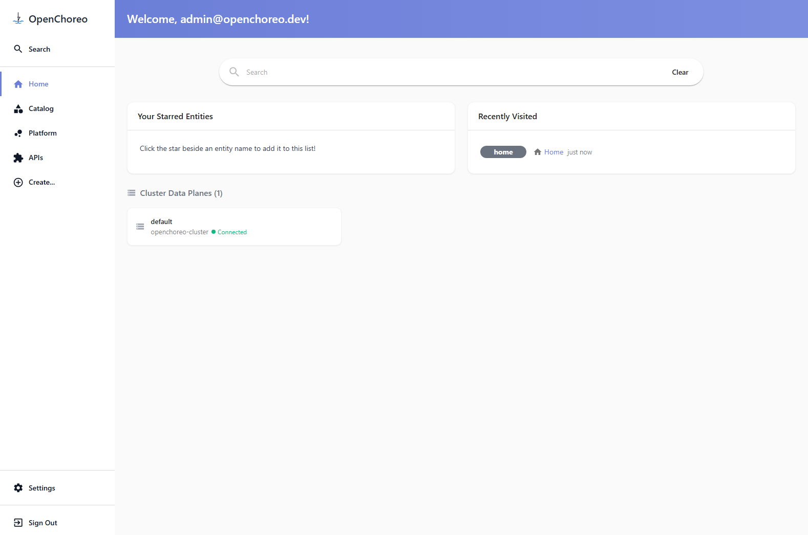
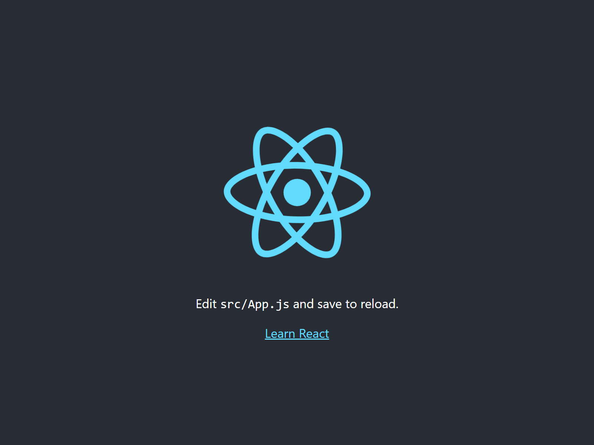

# Instalação do OpenChoreo

> Documento principal da entrega. Este arquivo consolida requisitos, execução, evidências, problemas encontrados, recursos criados e resultado final da instância local.

## Identificação da Atividade

- Aluno: Thiago Almeida
- Repositório: `ponderada-openchoreo-thiago-almeida`
- Caminho executado: A - instalação completa
- Plataforma de versionamento utilizada: GitHub
- Branch de trabalho: `feat/openchoreo-entrega`

## Objetivo

Criar uma instância local do OpenChoreo, validar o acesso à interface web e publicar uma aplicação de exemplo, documentando cada etapa com evidências reais.

## Resumo Executivo

A instalação local do OpenChoreo foi concluída com sucesso em ambiente Windows com Docker Desktop. A instância foi validada por verificações internas da própria stack, por acesso real à interface do portal e pelo deploy da aplicação React de exemplo. Os problemas encontrados foram operacionais, sem relação com limitação de hardware.

## Requisitos Mínimos da Atividade

- 4 GB de RAM disponíveis para Docker
- 2 CPUs disponíveis
- Docker Engine 26.0 ou superior recomendado

## Ambiente Utilizado

- Sistema operacional: Microsoft Windows 11 Home Single Language 64 bits
- Versão do sistema: 10.0.26200
- Docker Engine: 29.1.3
- Memória física do host: 16.89 GB
- CPUs lógicas do host: 16
- Memória disponível observada no container de verificação: 7.6 GiB
- CPUs disponíveis observadas no container de verificação: 16

## Comparação com os Requisitos

O ambiente atende os requisitos mínimos do Caminho A com margem. O Docker expôs mais de 4 GB de RAM e mais de 2 CPUs para o ambiente Linux utilizado pelos containers, então a instalação completa do Quick Start era tecnicamente viável.

## Evidências do Ambiente

- `docs/evidencias/01-sistema-operacional.txt`
- `docs/evidencias/02-docker-version.txt`
- `docs/evidencias/03-hardware-host.txt`
- `docs/evidencias/04-recursos-docker.txt`

## Evidências Visuais

### Portal do OpenChoreo



### Login no Thunder



### Home autenticada do OpenChoreo



### Aplicação React Starter publicada



## 1. Inicialização do Dev Container do OpenChoreo

### Comando base do enunciado

```bash
docker run --rm -it --name openchoreo-quick-start \
  --pull always \
  -v /var/run/docker.sock:/var/run/docker.sock \
  --network=host \
  ghcr.io/openchoreo/quick-start:v1.1.1
```

### Forma executada nesta entrega

Para manter a automação e ainda preservar o fluxo oficial, o container foi iniciado em background e os comandos foram executados dentro dele com `docker exec` usando o usuário `openchoreo`:

```bash
docker run -d -it --name openchoreo-quick-start \
  --pull always \
  -v /var/run/docker.sock:/var/run/docker.sock \
  --network=host \
  ghcr.io/openchoreo/quick-start:v1.1.1
```

### Resultado

O container do Quick Start foi iniciado com sucesso e permaneceu ativo para as etapas seguintes.

### Evidência

- `docs/evidencias/05-quick-start-container.txt`

## 2. Instalação do OpenChoreo

### Primeira Tentativa

A primeira execução da instalação foi feita com `docker exec` padrão:

```bash
docker exec -i openchoreo-quick-start sh -lc "cd /home/openchoreo && ./install.sh --version v1.1.1"
```

Ela falhou porque o `docker exec` entrou como `root`, e o `install.sh` bloqueia essa condição explicitamente.

### Erro Encontrado

- Mensagem principal: `This script should not be run as root.`
- Causa: `docker exec` sem `-u openchoreo`
- Correção adotada: repetir a execução com o usuário correto do container.

### Evidência da Falha

- `docs/evidencias/06-install-openchoreo.txt`

### Comando Corrigido

```bash
docker exec -i -u openchoreo openchoreo-quick-start bash -lc "cd /home/openchoreo && ./install.sh --version v1.1.1"
```

### Resultado da Instalação

- Status final: sucesso
- Tempo aproximado: 284 segundos, cerca de 4 minutos e 44 segundos
- Cluster criado: `openchoreo-quick-start`
- Interfaces publicadas:
  - `http://openchoreo.localhost:8080/`
  - `http://api.openchoreo.localhost:8080/`
  - `http://thunder.openchoreo.localhost:8080/`

### Observações Técnicas

Durante a execução apareceu um aviso de preload de imagens falhando. Isso não interrompeu a instalação; apenas indicou que alguns pulls poderiam ocorrer sob demanda e que os deploys poderiam ficar um pouco mais lentos. O restante dos componentes subiu normalmente.

### Evidência da Instalação Bem-Sucedida

- `docs/evidencias/07-install-openchoreo-corrigido.txt`

## 3. Verificação Pós-Instalação

### `check-status.sh`

O status final mostrou todos os componentes centrais em `READY`:

- Cert Manager
- KGateway
- External Secrets
- OpenBao
- Thunder
- Controller Manager
- API Server
- Backstage
- Cluster Gateway
- Cluster Agent
- Gateway Proxy

Os planos opcionais de Workflow e Observability ficaram como `NOT INSTALLED`, o que é consistente com a configuração base usada pelo Quick Start.

### `validate-installation.sh`

A validação abrangente confirmou:

- cluster k3d válido;
- kubeconfig válido;
- namespaces esperados presentes;
- Helm releases presentes;
- serviços principais válidos;
- pods prontos;
- ingress do kgateway válido.

### Evidências

- `docs/evidencias/08-check-status.txt`
- `docs/evidencias/09-validate-installation.txt`

## 4. Acesso à Interface Web

### URL Utilizada

- `http://openchoreo.localhost:8080/`

### Credenciais Padrão Utilizadas

- Username: `admin@openchoreo.dev`
- Password: `Admin@123`

### Resultado

O portal do OpenChoreo foi acessado com sucesso. O fluxo de autenticação redirecionou primeiro para a tela de `Sign In` do portal e depois para a página de login do Thunder. Após a autenticação, a home autenticada do OpenChoreo foi carregada normalmente.

### Evidências Visuais

- Tela inicial do portal: `docs/evidencias/11-openchoreo-login-page.png`
- Tela de autenticação do Thunder: `docs/evidencias/12-thunder-login-page.png`
- Home autenticada do OpenChoreo: `docs/evidencias/13-openchoreo-home.png`

### Observação Técnica

Para gerar as evidências visuais de forma repetível foi usado um script Selenium com Chrome headless. A primeira versão tentou encontrar os campos de login diretamente na página inicial do Backstage e falhou. Depois do ajuste para clicar primeiro em `Sign In` e só então autenticar no Thunder, a captura foi concluída com sucesso.

### Evidências dessa automação

- `docs/evidencias/13-captura-browser.txt`
- `docs/evidencias/14-captura-browser-corrigida.txt`
- `scripts/capture_openchoreo.py`

## 5. Publicação da Aplicação de Exemplo

### Comando executado

```bash
docker exec -i -u openchoreo openchoreo-quick-start bash -lc "cd /home/openchoreo && ./deploy-react-starter.sh"
```

### Resultado

O deploy da aplicação React Starter foi concluído com sucesso.

- Componente criado: `react-starter`
- Workload criado: `react-starter`
- Tempo aproximado do deploy: 36 segundos
- URL publicada:
  - `http://http-react-starter-development-default-cde5190f.openchoreoapis.localhost:19080`

### Validação da Aplicação

Foi feita uma requisição HTTP à aplicação publicada e também uma captura visual da página em execução.

### Evidências

- `docs/evidencias/15-deploy-react-starter.txt`
- `docs/evidencias/22-react-starter-response.html`
- `docs/evidencias/23-react-starter-app.png`

## 6. Recursos Criados e Interpretação

### Comandos Executados

```bash
kubectl get namespaces -l openchoreo.dev/control-plane=true
kubectl get clusterdataplanes
kubectl get environments
kubectl get projects
kubectl get clustercomponenttypes
kubectl get components
```

### Resultados Registrados

- `docs/evidencias/16-kubectl-namespaces.txt`
- `docs/evidencias/17-kubectl-clusterdataplanes.txt`
- `docs/evidencias/18-kubectl-environments.txt`
- `docs/evidencias/19-kubectl-projects.txt`
- `docs/evidencias/20-kubectl-clustercomponenttypes.txt`
- `docs/evidencias/21-kubectl-components.txt`

### Leitura dos Resultados

- Namespace com label de control plane: `default`
- ClusterDataPlane: `default`
- Environments: `development`, `staging`, `production`
- Project: `default`
- ClusterComponentTypes: `scheduled-task`, `service`, `web-application`, `worker`
- Component criado: `react-starter` no projeto `default`, tipo `deployment/web-application`

### Papel de Cada Recurso

- `Projects`: agrupam componentes e ajudam a separar domínios de negócio, times ou aplicações. Neste ambiente apareceu o projeto padrão `default`, criado para servir como escopo inicial.
- `Components`: representam as aplicações ou partes implantáveis. O componente `react-starter` foi o artefato principal publicado nesta atividade.
- `Environments`: representam estágios de promoção e operação, como `development`, `staging` e `production`. Eles organizam o ciclo de vida de deploy por ambiente.
- `Deployment Tracks`: são as trilhas de promoção e release entre ambientes. Mesmo sem um comando específico no enunciado para listá-las, elas fazem parte do modelo de progressão de uma aplicação ao longo dos ambientes.
- `Data Planes`: são os planos onde as cargas realmente executam. O `ClusterDataPlane default` representa o alvo de execução local usado pela instância Quick Start.
- `Backstage`: é a interface portal que centraliza catálogo, operações e experiência de desenvolvedor. No OpenChoreo local ele é a porta de entrada visual do ambiente.

## 7. Problemas Encontrados e Soluções Adotadas

### Problema 1: `install.sh` executado como root

- Sintoma: erro `This script should not be run as root.`
- Causa: `docker exec` sem o usuário do ambiente Quick Start.
- Solução: repetir a execução com `docker exec -u openchoreo`.

### Problema 2: preload de imagens falhou parcialmente

- Sintoma: aviso de `Image preloading failed - continuing with installation`.
- Impacto: apenas potencial lentidão adicional em pulls posteriores.
- Resultado prático: instalação concluída com sucesso e deploy da aplicação exemplo também funcionou.

### Problema 3: automação inicial do login não encontrava campos de usuário e senha

- Sintoma: timeout no Selenium ao procurar inputs na página inicial.
- Causa: a página inicial do portal mostra apenas o botão `Sign In`; os campos aparecem no provider de autenticação do Thunder.
- Solução: ajustar o script para clicar em `Sign In`, aguardar o redirecionamento e autenticar na tela correta.

### Problema 4: screenshot headless da aplicação exemplo falhou com caminho relativo

- Sintoma: erro ao gravar `23-react-starter-app.png`.
- Causa: o Chrome headless não resolveu corretamente o caminho relativo de saída.
- Solução: repetir a captura usando o caminho absoluto do arquivo.

## 8. Entregáveis Complementares

- Vídeo da apresentação: registrar o link final em `docs/apresentacao/README.md`
- Roteiro da apresentação: `docs/apresentacao/roteiro-video.md`

> Caso o vídeo publicado apresente erro, o roteiro completo permanece disponível no repositório para preservar o conteúdo da apresentação.

## 9. Conclusão

A atividade foi concluída com instalação completa do OpenChoreo no ambiente local. A instância foi validada por checagens internas, acesso web autenticado e deploy bem-sucedido da aplicação React de exemplo. Os problemas encontrados foram operacionais e contornáveis, sem evidência de limitação real de hardware.

## 10. Histórico de Commits

Este repositório foi organizado com commits no padrão Conventional Commits, excedendo o mínimo exigido pelo enunciado para manter rastreabilidade fina de cada etapa da atividade.
